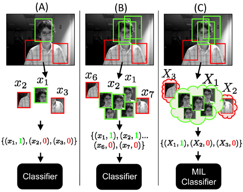
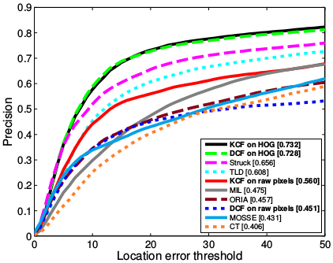

**Video Analiz ve Nesne Takibi** 
--------------------------------

Video analizi oldukça geniş bir konudur fakat temel anlamıyla video üzerinde hareket halindeki nesneleri video boyunca takip etmeyi kapsar. Takip algoritmalarını farklı kılan şey nesne tanıma algoritmaları gibi her görüntü karesi üzerinde neseneyi takip etmek yerine, takip edilmek istenilen nesnenin bir sonraki karede nerede olduğunu bulmaya çalışır.Bu yüzden hangi algoritmanın nerede kullanılacağına probleme göre karar vermek gerekir.

Bu bölümde video üzerinde hareket eden nesneleri takip edebilmemize olanak veren algoritmalara göz atacağız. Arkaplan çıkarma algoritmaları da dahil bir çok algoritma bu kapsamda ele alınabilir. Başlıca göreceğimiz algoritmalar:

* Mean Shift
* Camshift
* Optik Akış

ve OpenCV Object Tracker paketi altında yer alan bazı algoritmalar ise:

* GOTURN
* BOOSTING
* MIL
* KCF
* CSRT
* TLD
* MOSSE

**Ağırlıklı Ortalama Öteleme Algoritması (Mean Shift)**

Mean Shift farklı maalesef bir çok farklı şekilde Türkçeye çevriliyor, farklı akademik kaynaklara baktığımda “Ortalama Kaydırma”, “ Ağırlıklı Ortalama Kaydırma”vb. gibi bir çok farklı çevirisi var. TÜBA terimler sözlüğüne bakarak bende kendimce mantıklı olduğunu düşündüğüm “Ağırlıklı Ortalama Öteleme Algoritması” başlığını atmaya karar verdim.

Bu yazıda ele alacağımız konu hareketli bir nesnenin nasıl nakip edilebileceği olacak. Hareketli nesneleri takip etmek bilgisayarlı görü alanında çok sık karşılaşılan bir problemdir. Örneğin, kamera alanı içerisine giren bir canlı, bir alan içerisinde odaklanılması istenilen hedef, hareketinin analizine ihtiyaç duyulan bir nesne çok sıklıkla karşılaşılan örneklerindendir. Mean Shift algoritmasını kullanarak hareket halindeki bir “nesneyi” nasıl takip edebileceğimize bakmadan önce bu algoritmanın nasıl çalıştığına bir göz atalım.

Mean Shift Algoritması Nedir? Nasıl Çalışır?


Sanılanın aksine Mean Shift algoritması oldukça “eski”. Bu algoritmanın temelleri 1975 yılına kadar dayanıyor, fakat bu tarihde matematiksel olarak ifade edilsede kendisine bir yer bulamadı. Ta ki Dorin Comaniciu tarafından pratik olarak bir alanda kullanılıncaya dek.  İlgili makalesine buradan ulaşabilirsiniz http://www.comaniciu.net/Papers/MsRobustApproach.pdf.

Algoritmadaki mantık oldukça basitti, veri kümesi üzerindeki veri (bazı kaynaklarda nokta olarak geçer) dağılımının en yüksek olduğu yeri bulmayı sağlar. Yani elinizdeki bir görüntü ve devam edecek görüntü üzerinde (next frame) belirlenen bir alan içerisinde yer alan tepe noktaları belirlemesi sürecidir. Belirlenen tepe noktalar takip edilmek istenilen nesne olacaktır. Oldukça basit, hızlı ve işlevsel bir yöntemdir. Aşağıdaki görsellere bakalım, bu görsellerde görüntü üzerindeki nesneyi ve bu nesnenin piksellerinin kümelenmesini inceleyim.


Yukarıdaki görselde yer aldığı gibi bazı noktaların kümelenişini görebilirsiniz. Algoritmanın yaptığıda bu tepe noktalardaki kümelenmeleri her görüntü üzerinde yeniden hesaplayarak, değişen görüntü üzerinde istenilen nokta kümelerinin bulunmasıdır. Mean Shift algoritmasını zora sokan durumlardan birisi parlaklık yani görüntüye düşen ışık üzerindeki değişikliklerdir. Eğer ışık dengesi çok fazla değişiyorsa farklı ön işlemlere tutarak bu durumu elimine etmek gerekebilir. Tam da bu konuda oldukça faydası olan histogram eşitleme konusuna göz atmakta fayda var. Histogram eşitleme üzerine de bir yazı yazacağım fakat o zaman kadar buradaki bağlantıyı kullanarak bu konuya göz atabilirsiniz. http://www.yildiz.edu.tr/~bayram/sgi/saygi.htm


Mean Shift algoritmasının iplementasyonlarını OpenCV 2.3 sürümünde gördüğümü hatırlıyorum fakat kesin olarak hangi sürüm ile birlikte geldiğine dair detaylı bir araştırma yapmak gerek. Neyseki çokta önemli değil en popüler dağıtımların hepsi bunu destekliyor. Örnek uygulamada OpenCV 3.4 kullanacağım.

Senaryomuz oldukça basit olacak, örnek videoda bir SU27 yer alıyor (bilmeyenler için bu bir savaş jeti) amacımız SU27’yi (evet SU27’yi seviyorum 🙂 ) kesintisiz olarak takip edebilmek. Sizden gelen talepler üzerine Python örneği ekleyeceğim, fakat talebiniz olursa Java, Android vs. olarak da ekleyebilirim.


*Python:*
```Python
videoCapture = cv2.VideoCapture("video.mp4")

ret, frame = videoCapture.read()
rows, cols = frame.shape[:2]

w = 100
h = 150
col = int((cols - w) / 2)
row = int((rows - h) / 2)

shiftWindow = (col, row, w, h)
```

Yukarıda; Öncelikli olarak video capture ile örnek video dosyası yüklenir. Video dosyası üzerine Mean Shift için bir alan belirlenir. Bu alan 100×150 olarak belirlenmiş ve ağırlıklı ortalaması belirlenecek olan dörtgen alanıdır. Bu alanın boyutlarıyla oynayın, eğer ki algoritma nesnenizi tam olarak takip edemiyorsa belirlediğiniz dörtgen alan da problem olabilir. shiftWindow nesnesi artık bu alanı tanımlamaktadır.

```Python
lowLimit = np.array((0., 60., 32.))
highLimit = np.array((180., 255., 255.))

mask = cv2.inRange(roiHsv, lowLimit, highLimit)

roiHist = cv2.calcHist([roiHsv], [0], mask, [180], [0, 180])
cv2.normalize(roiHist, roiHist, 0, 255, cv2.NORM_MINMAX)
```

Şimdi görüntü üzerindeki parlaklığı, renk dağılımlarını dengelemek için bir maskeleme alanı oluşturalım ve bu alan üzerinde histogram eşitleme yapalım. Algoritmanın doğru ağırlıkları hesaplayabilmesi için bu önemli bir noktadır.

```Python
terminationCriteria = (cv2.TERM_CRITERIA_COUNT | cv2.TERM_CRITERIA_EPS , 15, 1)
```

Daha öncede sürekli yineleyen algoritmalar için gerekli bir parametre olan durdurma ölçütümüzü belirleyelim. Bu parametre algoritmanın kendi içerisinde kaydırma/hesaplama işlemini kaç defa yapacağını belirlemektedir. bu parametre değeri (15 olarak belirlediğim) size kalmıştır, bu parametre ile oynayın.

```Python
retVal , frame = videoCapture.read()
frameHsv = cv2.cvtColor(frame, cv2.COLOR_BGR2HSV)

backprojectedFrame = cv2.calcBackProject([frameHsv], [0], roiHist, [0, 180], 1)
```

Artık yukarıda da görebileceğiniz gibi video içerisinde öncelikli  HSV  renk uzayı üzerinde histogram alıp histogram back projection yapacağız ve tüm görüntü üzerinde istediğimiz yerin segmentlerini bulacağız.

```Python
mask = cv2.inRange(frameHsv, lowLimit, highLimit)
```

Algoritmanın sonucunu iyileştirmek için karanlık alanları maskeliyoruz.

```Python
ret, shiftWindow = cv2.meanShift(backprojectedFrame, shiftWindow, terminationCriteria)

col, row = shiftWindow[:2]
frame = cv2.rectangle(frame, (col, row), (col + w, row + h), 255, 2)
```
Daha önce belirlediğimiz dörtgen alanı kullanarak mean shift algoritmasını yine belirlediğimiz kriter ile başlatıyoruz, ve belirlediği alanı frame üzerine çiziyoruz.


| [](https://youtu.be/9qzaBzmmL7s) | 
|:--:| 
|*MeanShift Demo Video*|

**Camshift (Sürekli Mean Shift) Algoritması**

Eğer, MeanShift algoritmasının örnek projesini çalıştırdıysanız veya yukarıdaki videoyu izlediyseniz bir şeyi fark etmiş olabilirsiniz; sabit boyuttaki nesne alanı. Detaylandırmak gerekirse; MeanShift algoritması sürekli olarak , başlangıçta verdiğimiz boyutlarda bir kaydırma penceresi kullanır, bu durum takip edilmek istenilen alanın boyutunun sürekli olarak aynı kalmasına sebep olur çünkü MeanShift algoritmamız bir defa "initialize" edilmiş ve aynı pencereyi kullanarak çalışmaya devam etmiştir.

Bu sorun üzerine Gary Bradski (Learning OpenCV Kitabının Yazarı, Bilgisayar Bilimci) MeanShift algoritmasını her frame üzerinde sürekli olarak çalıştırarak, belirlenen kaydırma penceresini yeniden hesaplayarak boyutlandırmayı amaçlamış ve bunu başarmıştır. Yeni algoritma CamShift "Sürekli Uyarlanabilir Meanshift" algoritması olarak adlandırılmıştır.

Bu algoritmanın kullanımı, yukarıda anlatılan ve örnek projeler kısmında da bulabileceğiniz MeanShift algoritması ile benzer şekildedir.

```Python
   ret, shiftWindow = cv.CamShift(backprojectedFrame, shiftWindow, terminationCriteria)
 ```

**GOTURN Takip Algoritması**

GOTURN derin öğrenme tabanlı CNN kullanan bir nesne takip algoritmasıdır. Bu algoritma "Learning to Track at 100 FPS with Deep
Regression Networks" http://davheld.github.io/GOTURN/GOTURN.pdf makalesi ile duyrulmuştur. Bu algoritma ile art arda gelen bir dizi frame yani video üzerinde tek bir nesnenin takibi yapılabilir. Yolda giden bir araç, yürüyen bir insan veya yuvarlanan bir top kısacası videonun başında takip edilmesini istediğiniz şeyi videonun sonuna kadar takip edilebilir. Bu algoritma eğitilmiş bir model ile kullanılır, opencv iplemantasyonu için eğitilmiş bir caffe modeli mevcuttur.


|  | 
|:--:| 
|*Görsel Kaynağı: "Learning to Track at 100 FPS with Deep Regression Networks"* Makalesi Sayfa 2|

Yukarıdaki görselde eğitim ve test aşamaları özetlenmiştir. Veri seti eğitilirken bir çok hareket eden nesne videosundan yararlanılır, sinir ağı bu sayede bir sonraki frame de nesnenin yerini tahmin edebilir hale gelir. Burada dikkat edilmesi gereken nokta nesneyi tanıma işlemi yapmadan sadece tahmin edilmek için belirlenen alanın sonraki framelerde nerede olabileceğine karar verir. Test için ise **VOT** veri setinden yararlanılır.

**Boosting Takip Algoritması**

Boosting algoritması Cascade sınıflandırıcısında da kullanılan AdaBoost algoritmasına dayananır. Nesneyi tespit edebilmek için eğitilmiş negatif ve bozitif verilerden yararlanır. Negatif görüntü dediğimiz şey hedeflenen nesnenin bulunmadığı genellikle arka planların yer aldığı görüntülerdir. Pozitif görüntüler ise hedeflenen nesnenin yer aldığı görüntü setidir. Çok eski olan bu algoritmanın çalışma mantığı oldukça basittir. Diğer algoritmalarda olduğu gibi, giriş olarak görüntü üzerinden bir alan seçilerek verilir, bu alan takip edilmek istenilen nesnedir. Algoritma çalışma zamanında bu kare dışındaki alanları negatif veri seti alarak kabul eder ve her karede bir sınıflandırma yapar. Haar Cascade algoritmasında bizim tarafımızdan yapılan eğitim süreci bu algoritma tarafından sürekli olarak otomatik bir şekilde yapılır. Bu algoritma hızlı çalışıyor olsada oldukça başarısz bir sonuçlar vermektedir.

**MIL (Multiple Instance Learning) Takip Algoritması**

MIL takip algoritması temel olarak Boosting algoritmasına benzer şekilde çalışır. Boosting algoritması pozitif görüntü olarak sadece tarafımızdan verilen alanı kullanmaktaydı. Tek bir pozitif görüntü kullanılması veya pozitif görüntüler için kullanıcı/geliştirici ye bağımlı kalınması genellikle sonucu olumsuz olarak etkilemektedir.

MIL algoritması ile pozitif görüntülerde bir geliştirme yapıldı. Algoritma görüntü üzerinde belirtilen nesnenin alanını otomatik olarak çoklamaya başlamaktadır. Pozitif görüntü sayısını arttırmak için verilen alan ve çevresinden çokca farklı görüntü alıp algoritmayı bu görüntü parçaları ile eğitmektedir. Aşağıdaki görselde bu çoklama durum görülmektedir. Bu veri setini arttırmak için çok mantıklı ve kolay bir yoldur.

Fazla sayıda pozitif görüntü veri setine sahip olması bu algoritmanın başarısını Boosting karşısında ön plana çıkarmaktadır.

|  | 
|:--:| 
|*Görsel Kaynağı: http://vision.ucsd.edu/~bbabenko/new/project_miltrack.shtml*|


**CSRT (Discriminative Correlation Filter with Channel and Spatial Reliability) Takip Algoritması**

Bir kaç yıl önce "Discriminative Correlation Filter with Channel and Spatial Reliability" başlıklı makale ile duyurulan bu algoritma yine yakın bir zaman OpenCV 3.4 versiyonuna eklendi. OpenCV içerisinde yer alan başarılı takip algoritmalarından birisidir.


**KCF (Kernelized Correlation Filters) Takip Algoritması**

2015 yılında João F. Henriques, Rui Caseiro, Pedro Martins ve Jorge Batista tarafından geliştirilen bu yöntem yakın bir zaman içerisinde OpenCV'ye eklendi. KCF yukarıda bahsettiğimiz takip algoritmalara göre daha başarılı diyebiliriz. Bu algoritma seçilen nesnenin alanın eğitimi için diğerlerinden farklı bir yol izler. Elde ettiği pozitif görüntülerdeki başarısı sebebiyle daha doğru ve daha yüksek başarıya sahip sonuç verir.

Bu algoritmanın makalesine ve farklı programlama dillerindeki uyarlamasına buradaki bağlantıdan ulaşabilirsiniz. http://www.robots.ox.ac.uk/~joao/circulant/index.html

|  | 
|:--:| 
|*Görsel Kaynağı: http://www.robots.ox.ac.uk/~joao/circulant/index.html*|


**TLD (Tracking-Learning-Detection) Takip Algoritması**

TLD izleyici nesne takibi için üç aşamalı bir süreç izler; takip et, öğren ve tespit et. Bu algoritma 2010 yılında Zdenek Kalal, Krystian Mikolajczyk ve Jiri Matas tarafından "Tracking-Learning-Detection" başlıklı makale ile duyruldu. TLD gerçek zamanlı bir takip algoritmasıdır. Takip edilmek istenilen nesne belirlendikten sonra üç aşamalı süreç başlar.  Öncelikli olarak verilen nesne üzerinde eğitim gerçekleştirilir, takip işlemi devam ederken algoritma kendisini tekrardan düzeltir ve eğitir, eğitim sonucu nesne tekrardan belirlenir ve takip edilir. Bu işlem kısa süreli takip için çok başarılı olmayabilir, algoritmanın kendisini kısa sürede ne kadar düzelteceğini bilemezsiniz.

Bu algoritmayla ilgibi makaleye buradan (http://epubs.surrey.ac.uk/713800/1/Kalal-PAMI-2011%281%29.pdf), çeşitli örneklerin yer aldığı web sayfasına ise buradan (http://kahlan.eps.surrey.ac.uk/featurespace/tld/) ulaşabilirsiniz.


**MOSSE (Minimum Output Sum of Squared Error) Takip Algoritması**

MOSSE Korelasyon filtresi kullanan bir takip algoritmasıdır. Görüntü işleme algoritmalarından yararlananan bu algoritma oldukça hızlı çalışsada, derin öğrenme veya makine öğrenmesi kullanan algoritmalar göre başarı oranı düşüktür.

İlgili makaleye buradan (http://www.cs.colostate.edu/~vision/publications/bolme_cvpr10.pdf) ulaşabilirsiniz.  Bu algoritmayı daha yakından tanımak isterseniz "Practical Computer Vision" kitabına göz atabilirsiniz.
