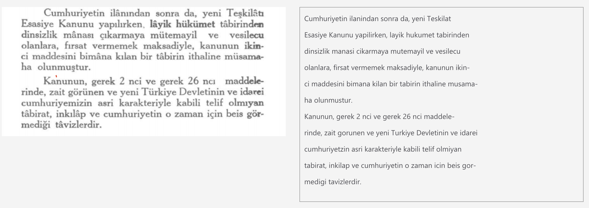
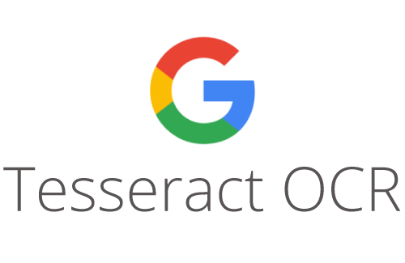

**OCR (Optical Character Recognition - Optik Karakter Tanıma)** 
---------------------------------------------------------------

Optik karakter tanıma; taranmış, fotoğraflanmış veya dijital olarak üretilmiş herhangi bir görüntü üzerinde yer alan metinlerin görüntü üzerinde tespit edilerek değiştirilebilir metin haline dönüştürülebilmesidir. OCR dijital olarak oluşturulmuş veya el yazısı ile yazılmış karakterleri tanıma yeteneğine sahiptir.

Algoritmaya göre bu aşamalar değişmekle birlikte OCR temel olarak üç aşamalı bir süreçtir;

1. Önişleme
2. Karakter Tespiti
3. Sınıflandırma

şimdi bu süreçlere bir göz atalım.

**1. Önişleme**

Görüntünün önişlenmesi; görüntü işlemenin ilgilendiği temelalanlardan bir tanesidir. Önişleme ile, görüntü üzerindeki gürültüler temizlenir, ışık dengesi yapılır, kırpma, boyutlandırma yapılır ve renk uzayı dönüşümleri gerçekleştirilebilir. Önişleme süreci kullanılan algoritmaya göre değiklik göstermekle birlikte bir çok algoritma için ise geliştirici tarafından önişlenmiş görüntünün girdi olarak verilmesi beklenir.

**2. Karakter Tespiti**

Bu bölümde görüntü üzerinde yer alan alfabatik karakterlerin tespit işlemi gerçekleştirilir. Görüntü üzerinde alfabatik karakterler dışında bir çok nesne yer alabilir, karakterler ile bu nesnelerin ayıklanması gerekmektedir bu işlemler karakter tespiti aşamasında gerçekleştirilir. Karakter tespiti aşamasında tespit edilen karakterlerin ne olduğu yani tanımlanması yapılmaz.

**3. Sınıflandırma**

Önişlenmiş ve karakter tespiti yapılmış görüntü üzerine karakterlerin ASCI karşılıklarının belirlenmesi sürecidir. Görüntü üzerinde yer alan metinler bir çok farklı fontla, farklı dille farklı şekilde yazılmış olabilir, bu da farklı veri setleri ile eğitilmiş bir sınıflandırıcı ihtiyacı doğurur. OCR algoritmasının başarı oranını etkileyen en önemli faktör buradaki sınıflandırıcının başarı oranıdır.

# Tesseract Kütüphanesi ile OCR

OCR için geliştirilmiş birçok kütüphane ve algoritma mevcuttur. Açık kaynak olarak geliştirilmiş ücretsiz en iyi kütüphanelerden birisi hiç şüphesiz ki **tesseract**'dır.

Tesseract 1985-1994 yılları arasında HP tarafından C++ ile geliştirilmiş bir kütüphanedir. 2006 yılından beri ise Google desteği ile geliştirilmeye devam etmektedir. En kararlı sürümü şuan için 4.0'dır. Tesseract UTF-8 desteğine sahiptir ve 100 den fazla dili desteklemektedir. 4. sürümü ile bilikte RNN(Recurrent Neural Network) çeşidi olan LTSM desteğine kavuşmuştur, bu sayede derin öğrenmeden yararlanarak daha iyi sonuçlar elde etmenize yardımcı olmaktadır.
