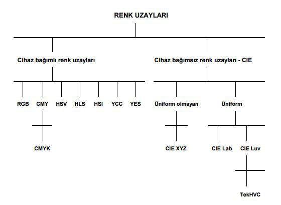
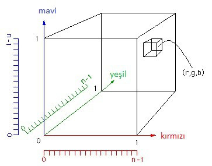
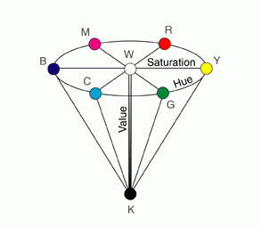
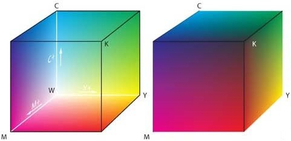
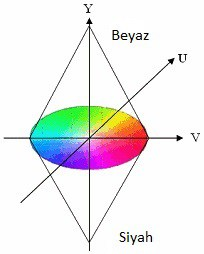
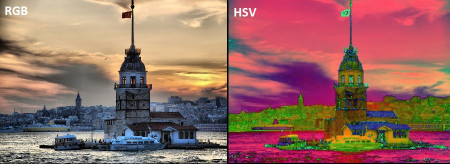
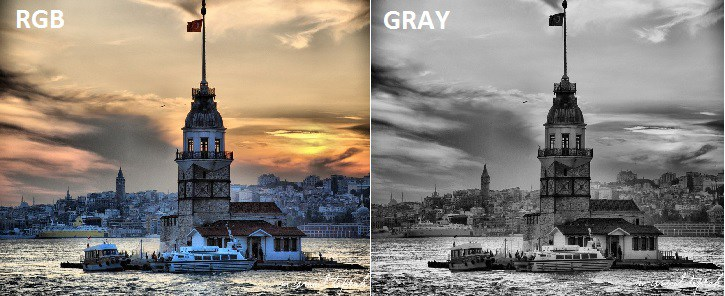

**Renk Uzayları ve Renk Uzayı Dönüşümü** 
----------------------------------------

Renk Uzayı: Renk çeşitliliğinin fazla olması nedeniyle bu renkleri gruplama ihtiyacı doğmuştur bu renkleri gruplamak ve standartlaştırmak için renk uzayı (color space) kavramı ortaya çıkmıştır.  Her renk uzayı, renk kümesini tanımlamak için kendine özgü bir yapıya sahiptir. Örneğin siyah beyaz bir görüntüyü dijitalleştirmek için çok fazla kavrama gerek yoktur. Görüntü siyah ve beyaz olmak üzere 2 adet değişkene sahiptir. 300×300 boyutunda dijital siyah beyaz bir görüntü dijitalleştirilip renklendirilirken, 300×300 boyutunda bir dizi oluşturulur. Renklendirme işlemi için ise 2 adet değişken olduğu için 1 ve 0 yeterlidir. Fakat renkli bir resim üzerinde farklı renk tonları olacağı için 1 ve 0 ile bu görüntüyü tanımlamak yetersiz olacaktır. Bu farklı durumlar için çeşitli renk uzayları belirlenmiştir. En çok kullanılan ve kitap boyunca yer alacak örneklerde de kullanılan renk uzaylarına göz atalım.




RGB Renk Uzayı: 

Bu renk uzayı Red Green Blue yani kırmızı, yeşil ve mavi renklerin baş harfi ile adlandırılmıştır. Renkler bir küp olarak tanımlanır bu tanımla sayesinde 3 değişkenli bir dizi elde edilir. Bu dizi elemanları olan hücreler yani pikseller, bir rengi tutabilmek için 3 renk olan kırmızı, yeşil ve mavinin belirli yoğunlukta karıştırılması ile elde edilen renk kodunu tutarlar.



HSV Renk Uzayı: 

HSV Hue, Saturation, Value yani renk özü, doygunluk ve parlaklık olarak adlandırılmıştır. Anlaşıldığı üzere renk tanımlamalarını bu üç kavrama göre gerçekleştirir.




CMYK Renk Uzayı: 

Cyan, Magenta, Yellow, Key rengin kısaltmasıdır. Buradaki key siyah rengi temsil etmektedir. CMYK renk uzayı, dijital renk tanımlamaları için belirtilen bu dört rengi karıştırarak yapmaktadır.




YUV Renk Uzayı: 

Y Luminance, U Chrominance1, V Chrominance2 kısaltmasıdır. Y siyah – beyaz U ve V ise mavi tabanlı renklilik ve kırmızı tabanlı renkliliği temsil eder. Renkler bu üç kavram ile temsil edilerek oluşturulurlar.

Bizim için dijital görüntü işlemede en önemli olan renk uzaylarını tanımladık. Diğer renk uzaylarına ise OpenCV ile renk uzayları arası dönüşümü konusunda kullandıkça değineceğim.




**Renk Uzayı Dönüşümü**
Daha önce temel dijital görüntü işleme kavramları bölümünde renklere ve renk uzaylarına değinmiştir. OpenCV’de birçok renk uzayı desteklenmektedir ve bunlar arasında dönüşüm yapılabilmektedir. Bu bölümde OpenCV ile bu renk uzayları arasında dönüşüm işlemleri için Imgproc sınıfı içerisinde cvtColor() metodu bulunmaktadır. cvtColor metodu parametre olarak iki adet mat nesnesi ve dönüşüm yapılacak olan renk uzayını almaktadır.


``` Java
Imgproc.cvtColor(srcMat, dstMat, code);
cv2.cvtColor(...)
```


srcMat: Kaynak bir mat nesnesi yani dönüşümü yapılacak olan görüntü, dstMat: hedef mat nesnesi yani dönüşüm sonucunda oluşacak yeni renk uzayına sahip görüntü, code ise hangi renk uzayları arasında dönüşüm yapılacağıdır. Desteklenen bazı renk uzayları aşağıdaki tabloda yer almaktadır.


dstMat: Hedef mat nesnesi, çıktının set edileceği obje.


Code:
Kaynak Renk Uzayı 2 Hedef Renk Uzayı
* COLOR_RGB2BGR
* COLOR_RGB2BGRA
* COLOR_RGB2GRAY
* COLOR_GRAY2RGB
* OLOR_RGB2HLS
* OLOR_HSV2RGB
* OLOR_RGB2HSV
* OLOR_RGB2Luv
* COLOR_HSV2RGB
* COLOR_RGB2YUV
* COLOR_RGB2Lab

Örnek dönüşüm:

RGB (Red Greeb Blue – Kırmızı Yeşil Mavi) renk uzayından HSV (Hue Saturation Value – Renk tonu Doygunluk Değer) renk uzayına dönüşüm.

*Java:*
``` Java
public static void main(String[] args) {
	System.loadLibrary(Core.NATIVE_LIBRARY_NAME);
	Mat kaynakGoruntu=new Mat();
	kaynakGoruntu=Imgcodecs.imread("C:\\kizkulesi.jpg");	
	Mat hedefGoruntu=new Mat();
      //Okunanan RGB görüntüyü HSB renk uzayına çevirerek hedefGoruntu mat nesnesine atar
	Imgproc.cvtColor(kaynakGoruntu, hedefGoruntu, Imgproc.COLOR_RGB2HSV);
     	Imgcodecs.imwrite("C:\\ kizkulesiHSV.jpg", hedefGoruntu);
}
```


*Python:*

``` python
import cv2
frame = cv2.imread("turkey-logo.jpg")
#RGB Renk uzayından gri renk uzayına çevrim
sonuc = cv2.cvtColor(frame,cv2.COLOR_RGB2GRAY)
cv2.imshow("Sonuc", sonuc)
cv2.waitKey(0)

```



Sistemdeki kameradan alınan görüntü üzerine de aynı işlemi uygulayarak, akış halindeki bir görüntünün renk uzayı değiştirilebilir. Bazı renk uzayları arasındaki dönüşüm kaliteli bir sonuç vermeyebilir, her renk uzayı farklı geometrik biçimlerde ifade edilmektedir, bu ifade şekli matematiksel olarak bazı renk uzayları arasındaki dönüşüme engel teşkil etmektedir.

Ek Bilgi:

Eğer renk dönüşümünü kendiniz yapmak isterseniz; RGB bir pikselin değeri; kırmızı kanalının %30’u (0.2989), yeşil kanalın %59’u (0.5870) ve mavi kanalın %11’i (0.1144) alınarak toplanması neticesinde bulunmaktadır. Bu demek oluyor ki: GRI_SEVIYE_GORUNTU=0.2989*[1.KATMAN RED]+0.5870*[2.KATMAN GREEN]+0.1140*[3.KATMAN BLUE];